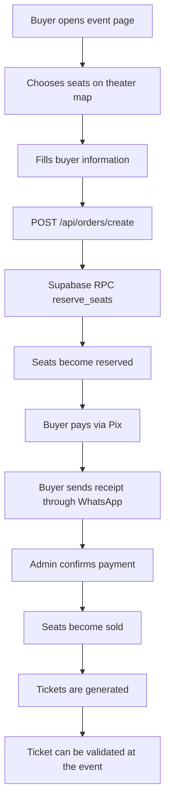
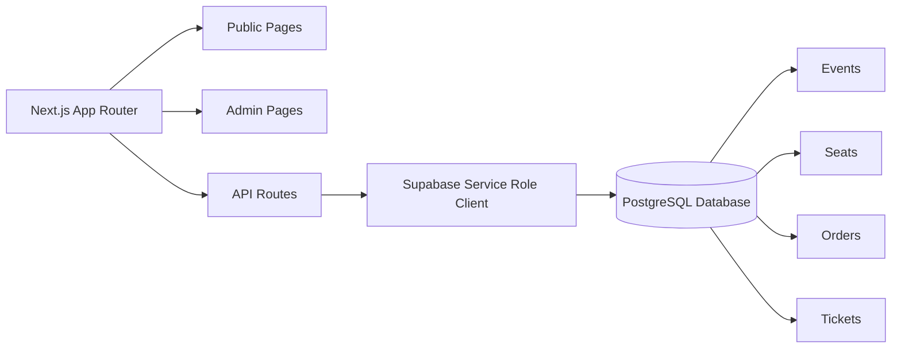

# 🎟️ Dança & Tradição Tickets

<p align="center">
  
</p>

<h3 align="center">
  A ticket reservation MVP for dance events with seat selection, manual Pix validation and admin management.
</h3>

<p align="center">
  <strong>Next.js · TypeScript · Supabase · Tailwind CSS · Vercel · Seat Map · Manual Payment Flow</strong>
</p>

<p align="center">
  
  
  
  
  
  
</p>

---

## 📌 About the Project

**Dança & Tradição Tickets** is a web application MVP created to manage ticket reservations for a dance show.

The system allows visitors to choose numbered seats on a theater map, fill in buyer information, reserve seats, pay manually via Pix and send proof of payment through WhatsApp. After manual payment confirmation by an administrator, the system marks the seat as sold and generates the final ticket.

This project was designed for a real-world event scenario where simplicity, low cost and operational control are more important than a fully automated payment gateway.

### 🇧🇷 Descrição em Português

O **Dança & Tradição Tickets** é um MVP para venda e reserva de ingressos de espetáculos de dança, com escolha de assentos numerados, pagamento via Pix, validação manual pelo WhatsApp, painel administrativo e geração de tickets após confirmação do pagamento.

---

## 🎯 Project Goal

The main goal is to provide a simple and reliable ticket flow for an event organizer:

1. The buyer accesses the event page.
2. The buyer chooses one or more available seats.
3. The buyer fills in name, phone, CPF and email.
4. The system creates a reservation in the database.
5. The buyer pays via Pix and sends the receipt through WhatsApp.
6. The admin manually confirms the payment.
7. The system marks seats as sold and creates the ticket.

---

## ✨ Features

### Public Area

- 🎭 Event landing page
- 🗺️ Venue and location information
- 📍 Google Maps integration
- 🎟️ Ticket purchase flow
- 💺 Interactive theater seat map
- 🧾 Buyer form with validation
- 💰 Automatic total price calculation
- ⏳ Reservation flow before payment confirmation
- 📲 Pix + WhatsApp manual payment instructions
- 🎫 Ticket page after admin confirmation

### Admin Area

- 🔐 Admin access protected by password/session cookie
- 📊 Admin dashboard
- 🔎 Search reservations by buyer data, reservation code, ticket or seat
- ✅ Manual payment confirmation
- ❌ Reservation cancellation
- 🚫 Seat blocking
- 🔓 Seat unblocking
- 📤 Paid orders CSV export
- 🎫 Ticket validation
- 🕒 Used ticket tracking

### Backend / Data

- 🧠 Supabase database
- 🧩 PostgreSQL functions for reservation and ticket logic
- 🔒 Row Level Security enabled
- 🪑 Seat status control: `available`, `reserved`, `sold`, `blocked`
- 🎲 Unique reservation and ticket codes
- 🧱 Database-level protection against duplicated active orders for the same seat

---

## 🧠 How It Works



---

## 🏗️ Architecture



The application uses **Next.js App Router** for pages and API routes. Sensitive operations are executed server-side through a Supabase admin client using the service role key.

---

## 🛠️ Tech Stack

### Core

| Technology | Usage |
|---|---|
| Next.js 14 | Application framework and routing |
| React 18 | UI rendering |
| TypeScript | Type safety |
| Tailwind CSS | Styling and layout |
| Supabase | Database and backend services |
| PostgreSQL | Relational data model |
| PL/pgSQL | Reservation and ticket database functions |
| Vercel | Hosting and deployment |

### UI / Developer Experience

| Technology | Usage |
|---|---|
| Lucide React | Icon library |
| ESLint | Code linting |
| PostCSS | CSS processing |
| Autoprefixer | CSS browser compatibility |
| Next Image | Optimized image handling |

---

## 📁 Project Structure

```bash
IngressosDancaeTradicao/
├── database/
│   ├── schema.sql
│   ├── seed.sql
│   └── seat-map-640.sql
├── public/
│   ├── danca-tradicao-logo.png
│   ├── pix-qrcode-placeholder.svg
│   ├── teatro-auditorio.jpg
│   └── teatro-fachada.jpg
├── src/
│   ├── app/
│   │   ├── api/
│   │   ├── comprar/
│   │   ├── pagamento/
│   │   ├── ticket/
│   │   └── page.tsx
│   ├── components/
│   │   ├── PurchaseClient.tsx
│   │   ├── SeatLegend.tsx
│   │   └── SeatMap.tsx
│   ├── config/
│   │   └── event.ts
│   ├── lib/
│   └── types/
├── package.json
├── tailwind.config.ts
├── tsconfig.json
└── README.md
```

---

## 📄 Main Files

| File | Description |
|---|---|
| `src/config/event.ts` | Central event configuration |
| `src/app/page.tsx` | Public event landing page |
| `src/app/comprar/page.tsx` | Ticket purchase page |
| `src/components/PurchaseClient.tsx` | Buyer form, seat selection and reservation submit |
| `src/components/SeatMap.tsx` | Theater seat map component |
| `src/app/api/orders/create/route.ts` | API route responsible for creating reservations |
| `src/lib/supabase/server.ts` | Server-side Supabase admin client |
| `src/lib/admin-auth.ts` | Admin session/password helpers |
| `database/schema.sql` | Database tables, indexes, functions and RLS setup |

---

## ⚙️ Requirements

- Node.js 20+
- npm
- Supabase project
- Vercel account
- Environment variables configured

---

## ▶️ Running Locally

Install dependencies:

```bash
npm install
```

Create a local environment file:

```bash
cp .env.example .env.local
```

If `.env.example` is not available yet, create `.env.local` manually using the variables below.

Run the development server:

```bash
npm run dev
```

Open:

```bash
http://localhost:3000
```

---

## 🔐 Environment Variables

Create `.env.local` with:

```bash
NEXT_PUBLIC_SUPABASE_URL=
NEXT_PUBLIC_SUPABASE_ANON_KEY=
SUPABASE_SERVICE_ROLE_KEY=
ADMIN_PASSWORD=
NEXT_PUBLIC_SITE_URL=http://localhost:3000
```

> Important: `SUPABASE_SERVICE_ROLE_KEY` must only be used server-side. Never expose this key in the browser.

---

## 🗄️ Supabase Setup

1. Create a Supabase project.
2. Open the SQL Editor.
3. Run:

```bash
database/schema.sql
```

4. Run:

```bash
database/seed.sql
```

5. If needed, run the 640-seat map script:

```bash
database/seat-map-640.sql
```

The expected theater map contains:

| Section | Seats |
|---|---:|
| Left orchestra | 96 |
| Center orchestra | 320 |
| Right orchestra | 96 |
| Balcony / second floor | 128 |
| **Total** | **640** |

---

## 🔒 Seat Reservation Safety

The reservation flow is not protected only by the frontend.

The backend calls a Supabase/PostgreSQL function that:

- checks buyer data
- locks the selected seat row
- verifies if the seat is still available
- creates the order with `pending_payment`
- changes the seat status to `reserved`
- returns a unique reservation code

The database also includes a partial unique index to prevent more than one active order for the same seat.

---

## 🎫 Ticket Flow

Ticket generation happens only after manual payment confirmation.

When the admin confirms a payment:

1. the order status becomes `paid`
2. the seat status becomes `sold`
3. a unique ticket code is generated
4. the ticket can be validated at the event entrance
5. the ticket receives a `used_at` timestamp after validation

---

## 🧪 Available Scripts

```bash
npm run dev
```

Starts the local development server.

```bash
npm run build
```

Builds the production application.

```bash
npm run lint
```

Runs Next.js linting.

```bash
npm run typecheck
```

Runs TypeScript type checking without emitting files.

---

## 🧭 Routes

### Public Routes

| Route | Description |
|---|---|
| `/` | Public event landing page |
| `/comprar` | Buyer form and seat map |
| `/pagamento/[reservationCode]` | Pix and WhatsApp payment instructions |
| `/ticket/[ticketCode]` | Ticket page after confirmation |

### Admin Routes

| Route | Description |
|---|---|
| `/admin` | Admin dashboard |
| `/admin/reservas` | Reservation management and search |
| `/admin/assentos` | Seat map management |
| `/admin/validar` | Ticket validation |

### API Routes

| Route | Description |
|---|---|
| `GET /api/health` | Environment and Supabase diagnostic |
| `GET /api/seats` | Returns seats and their current status |
| `POST /api/orders/create` | Creates a reservation |
| `GET /api/orders/[reservationCode]` | Returns reservation information |
| `POST /api/admin/orders/[id]/confirm-payment` | Confirms manual payment |
| `POST /api/admin/orders/[id]/cancel` | Cancels a reservation |
| `POST /api/admin/seats/[id]/block` | Blocks a seat |
| `POST /api/admin/seats/[id]/unblock` | Unblocks a seat |
| `GET /api/admin/export-csv` | Exports paid orders as CSV |
| `POST /api/admin/tickets/validate` | Validates a ticket |

---

## 🧪 QA Opportunities

This project is a strong candidate for QA documentation and test practice.

Suggested QA artifacts:

- Manual test plan
- Test cases for reservation creation
- Test cases for duplicated seat prevention
- Admin payment confirmation checklist
- Ticket validation checklist
- CSV export validation
- Mobile responsiveness checklist
- Security checklist for exposed data
- Regression checklist after database changes

Example scenarios:

| Scenario | Expected Result |
|---|---|
| Buyer selects an available seat | Seat is added to the selected list |
| Buyer selects more than the allowed limit | System prevents the selection |
| Buyer submits invalid CPF | Form shows validation error |
| Two buyers try the same seat | Only one active reservation is created |
| Admin confirms payment | Order becomes paid and ticket is generated |
| Admin validates ticket twice | Second validation shows it was already used |

---

## 📦 Deployment on Vercel

1. Push the project to GitHub.
2. Import the repository on Vercel.
3. Configure all environment variables.
4. Deploy the project.
5. Update `NEXT_PUBLIC_SITE_URL` with the final production URL.
6. Replace the placeholder Pix QR Code with the real Pix QR Code image.

---

## ⚠️ MVP Notes

- Payment is 100% manual.
- There is no Pix API, webhook or payment gateway in this version.
- The QR Code image is a placeholder and must be replaced before production usage.
- Pending reservations do not expire automatically yet.
- The admin flow depends on `ADMIN_PASSWORD`.
- CPF data should be handled carefully and should not be exposed unnecessarily.
- The service role key must remain server-side only.

---

## 🧭 Roadmap / Future Improvements

- [ ] Add real screenshots to this README
- [ ] Add a live production link
- [ ] Add `.env.example`
- [ ] Add automated tests for validation functions
- [ ] Add tests for reservation API routes
- [ ] Add E2E tests for purchase and admin flows
- [ ] Add automatic reservation expiration
- [ ] Add email provider configuration documentation
- [ ] Add proper authentication for admin users
- [ ] Add rate limiting to public reservation endpoints
- [ ] Add audit log for admin actions
- [ ] Add ticket QR Code generation
- [ ] Add payment gateway integration as a future optional module
- [ ] Add dashboard charts for sales and occupancy
- [ ] Improve accessibility for the seat map
- [ ] Add CI workflow with lint, typecheck and build

---

## 💡 What I Learned

This project helped practice:

- building a real-world reservation system
- designing a ticket purchase flow
- working with Next.js App Router
- creating API routes
- integrating Supabase with server-side operations
- modeling relational data for events, seats, orders and tickets
- using PostgreSQL functions to protect critical business rules
- creating an admin dashboard
- handling manual payment workflows
- documenting MVP limitations clearly

---

## 👨‍💻 Author

Developed by **Yruam Käffer de Faria**.
